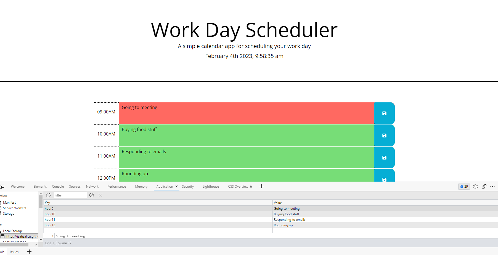

# Work Day Scheduler
   A simple web application that allows users to schedule events during standard business hours (9AM to 5PM).

## Third-Party APIs:  Moment.js

## Features

My app does:

* Display the current day at the top of the calender when a user opens the planner.
 
* Present timeblocks for standard business hours when the user scrolls down.
 
* Color-code each timeblock based on past, present, and future when the timeblock is viewed.
 
* Allow a user to enter an event when they click a timeblock

* Save the event in local storage when the save button is clicked in that timeblock.

* Persist events between refreshes of a page

The following animation demonstrates the application functionality:

## Getting Started
- Clone or download the repository
- Open the index.html file in a web browser
- Use the application by entering events in the text area for each time block
- Save events by clicking the save button for each time block

## Built With
- JQuery
- Moment.js
- HTML
- CSS
- Local Storage API

## Future Improvements
* Add the ability to delete events
* Add the ability to edit events
* Add the ability to move events between time blocks

## Contributions
      All contributions are welcome. If you have any suggestions or improvements, please feel free to submit a pull request.

